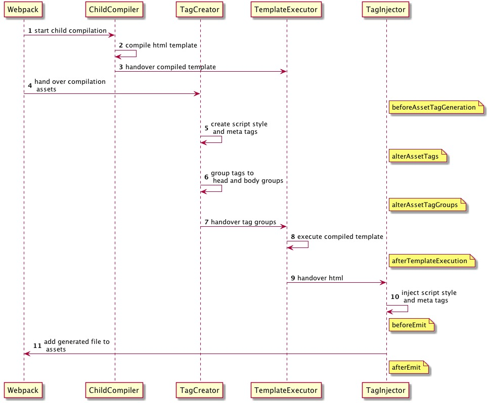

## 背景

项目里有用到`inline-manifest-webpack-plugin`，当把`html-webpack-plugin`升级到`v4`时，插件就报错了。原本想等插件适配，结果发现不维护了。所以自己动手实现一个吧！

## webpack 构建流程

`webpack`的基本构建流程如下：

1. webpack 初始化: 包括校验配置文件，初始化默认插件，创建`Compiler`实例等
2. run: 执行 run 方法
3. compilation：创建`Compilation`实例，回调`compilation`相关钩子
4. emit：文件内容已经解析完毕，准备生成文件
5. afterEmit：文件已经写入磁盘
6. done：完成编译

## webpack 插件实例

`webpack-plugin`需要实现一个`apply`方法，参数是`Compiler`实例，下面是一个简单的实例

```
class MyWebpackPlugin {
  constructor(options) {}
  apply(compiler) {
    compiler.hooks.emit.tap("MyWebpackPlugin", (compilation) => {
      console.log("MyWebpackPlugin");
    });
  }
}
module.exports = MyWebpackPlugin;
```

只需要在`webpack`的配置文件中，添加插件就能在控制台看见输出了

```
module.exports = {
  plugins:[
    new MyWebpackPlugin(),
  ]
};
```

要实现`inline-manifest-webpack-plugin`的功能，只需要在合适的`hook`里面实现我们的逻辑就行了

[更多 hook][1]

## inline-manifest-webpack-plugin 的作用

将我们选择的`chunk`文件直接插入到`html`中，减少请求次数，方便做缓存等，一般用来抽离 webpack 的运行时文件(runtime.js)。它大概实现了一下三个功能：

1. 删除`index.html`里的`script`标签
2. 将删除标签所对应的内容直接插入`index.html`
3. 删除原来的`js`文件

### 删除 index.html 里的 script 标签

`inline-manifest-webpack-plugin`是基于`html-webpack-plugin`上的插件，`html-webpack-plugin`为我们提供的 hook 如图所示



在生成标签之前(beforeAssetTagGeneration)去掉指定 chunk 文件

```
compiler.hooks.compilation.tap("InlineManifestWebpackPlugin", (compilation) => {
  // 在标签生成之前
  HtmlWebpackPlugin.getHooks(compilation).beforeAssetTagGeneration.tapAsync(
    "InlineManifestWebpackPlugin",
    (htmlPluginData, cb) => {
      const assets = htmlPluginData.assets;
      const manifestAssetName = this.getAssetByName(compilation.chunks, this.chunkName);

      if (manifestAssetName) {
        const runtimeIndex = assets.js.indexOf(assets.publicPath + manifestAssetName);

        // 缓存第二步里插入的内容和位子
        this.chunkScript = {
          tagName: "script",
          closeTag: true,
          attributes: {
            type: "text/javascript",
          },
          innerHTML: sourceMappingURL.removeFrom(compilation.assets[manifestAssetName].source()),
        };
        this.chunkIndex = runtimeIndex;

        // 从html中删除原标签
        if (runtimeIndex !== -1) {
          assets.js.splice(runtimeIndex, 1);
          delete assets.js[this.chunkName];
        }
      }
      cb(null, htmlPluginData);
    }
  );
});
```

### 将删除标签所对应的内容直接插入 index.html

生成标签的时候把第一步缓存的标签插入

```
compiler.hooks.compilation.tap("InlineManifestWebpackPlugin", (compilation) => {
  // 插入标签
  HtmlWebpackPlugin.getHooks(compilation).alterAssetTags.tapAsync(
    "InlineManifestWebpackPlugin",
    (htmlPluginData, cb) => {
      // 向html中注入
      if (this.chunkScript && this.chunkIndex !== -1) {
        htmlPluginData.assetTags.scripts.splice(this.chunkIndex, 0, this.chunkScript);
        this.chunkScript = null;
        this.chunkIndex = -1;
      }

      cb(null, htmlPluginData);
    }
  );
});
```

### 删除原来的 js 文件

在 webpack 生成所以文件之后，删除原本的文件

```
// 在emit阶段插入钩子函数
compiler.hooks.emit.tap("InlineManifestWebpackPlugin", (compilation) => {
  // 删除原文件
  delete compilation.assets[this.getAssetByName(compilation.chunks, this.chunkName)];
});
```

此时插件的功能基本上实现完成，一下是完整代码

```
const sourceMappingURL = require("source-map-url");
const HtmlWebpackPlugin = require("html-webpack-plugin");

class InlineManifestWebpackPlugin {
  constructor(chunkName) {
    this.chunkName = chunkName || "runtime";
    this.chunkScript = null;
    this.chunkIndex = -1;
  }

  getAssetByName = (chunks, chunkName) => {
    return (chunks.find((chunk) => chunk.name === chunkName) || { files: [] }).files[0];
  };

  apply(compiler) {
    // 注入 html-webpack-plugin 的处理过程
    compiler.hooks.compilation.tap("InlineManifestWebpackPlugin", (compilation) => {
      // 在标签生成之前
      HtmlWebpackPlugin.getHooks(compilation).beforeAssetTagGeneration.tapAsync(
        "InlineManifestWebpackPlugin",
        (htmlPluginData, cb) => {
          const assets = htmlPluginData.assets;
          const manifestAssetName = this.getAssetByName(compilation.chunks, this.chunkName);

          if (manifestAssetName) {
            const runtimeIndex = assets.js.indexOf(assets.publicPath + manifestAssetName);

            this.chunkScript = {
              tagName: "script",
              closeTag: true,
              attributes: {
                type: "text/javascript",
              },
              innerHTML: sourceMappingURL.removeFrom(compilation.assets[manifestAssetName].source()),
            };
            this.chunkIndex = runtimeIndex;

            // 从html中删除原标签
            if (runtimeIndex !== -1) {
              assets.js.splice(runtimeIndex, 1);
              delete assets.js[this.chunkName];
            }
          }
          cb(null, htmlPluginData);
        }
      );

      // 插入标签
      HtmlWebpackPlugin.getHooks(compilation).alterAssetTags.tapAsync(
        "InlineManifestWebpackPlugin",
        (htmlPluginData, cb) => {
          // 向html中注入
          if (this.chunkScript && this.chunkIndex !== -1) {
            htmlPluginData.assetTags.scripts.splice(this.chunkIndex, 0, this.chunkScript);
            this.chunkScript = null;
            this.chunkIndex = -1;
          }

          cb(null, htmlPluginData);
        }
      );
    });

    // 在emit阶段插入钩子函数
    compiler.hooks.emit.tap("InlineManifestWebpackPlugin", (compilation) => {
      // 删除原文件
      delete compilation.assets[this.getAssetByName(compilation.chunks, this.chunkName)];
    });
  }
}

module.exports = InlineManifestWebpackPlugin;
```

[1]: https://webpack.docschina.org/api/compiler-hooks/
